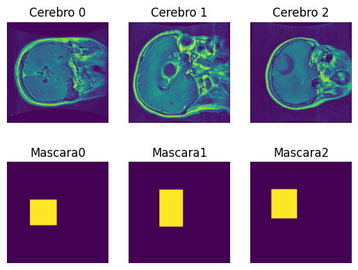
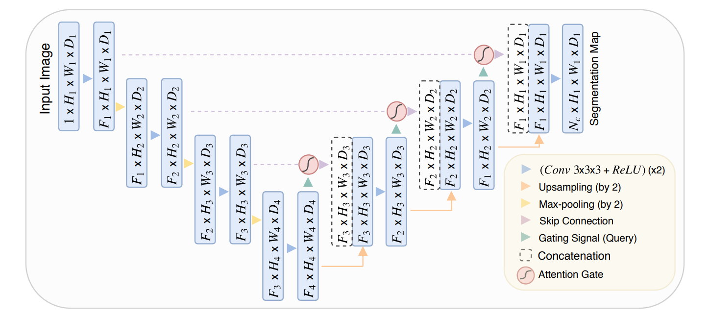
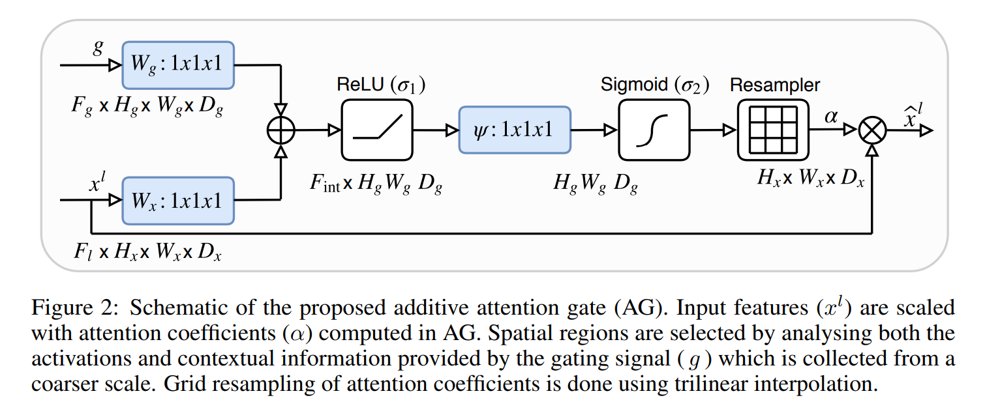
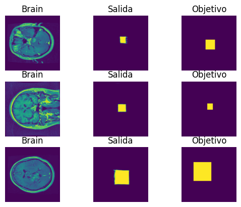

# Implementation of Attention U-NET.

I implement the Attention U-NET architecture proposed on the next paper:

[Oktay, O., Schlemper, J., Folgoc, L. L., Lee, M., Heinrich, M., Misawa, K., Mori, K., McDonagh, S., Hammerla, N. Y., Kainz, B., Glocker, B., & Rueckert, D. (2018). Attention U-Net: Learning where to look for the pancreas.](https://arxiv.org/abs/1804.03999)

## Dataset.
I used  the next dataset.

[Brain Tumor Image DataSet : Semantic Segmentation](https://www.kaggle.com/datasets/pkdarabi/brain-tumor-image-dataset-semantic-segmentation)

The objective of the network is to predict the mask that segment the tumor on the brain image.

## The architecture
The architecture of the model is given by the diagram.

The interesting part of the NN is the attention gate embedded.

## Results
After training, we got  got well segmentated images. As can be seen on the image below.
